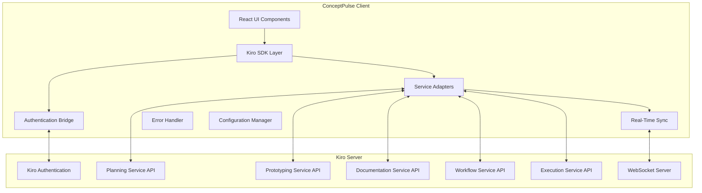

# Design Document

## Overview

This design document outlines the architecture and implementation approach for integrating ConceptPulse with a real Kiro server. The integration will replace mock implementations with actual Kiro IDE services, providing full functionality for planning, prototyping, documentation, workflows, and execution.

## Architecture

### High-Level Architecture



### Component Architecture

#### 1. Kiro SDK Layer
- **Purpose**: Primary interface between ConceptPulse and Kiro server
- **Responsibilities**:
  - Service discovery and connection management
  - API request/response handling
  - Connection pooling and optimization
  - Request batching and caching

#### 2. Authentication Bridge
- **Purpose**: Manages authentication between ConceptPulse and Kiro
- **Responsibilities**:
  - Single sign-on integration
  - Token management and refresh
  - Session synchronization
  - Security policy enforcement

#### 3. Service Adapters
- **Purpose**: Translate between ConceptPulse interfaces and Kiro APIs
- **Responsibilities**:
  - API call translation
  - Data format conversion
  - Error handling and retry logic
  - Service-specific optimizations

#### 4. Real-Time Sync Engine
- **Purpose**: Maintains real-time synchronization with Kiro server
- **Responsibilities**:
  - WebSocket connection management
  - Event streaming and processing
  - Conflict resolution
  - Offline queue management

#### 5. AI Assessment Service
- **Purpose**: Integrates Gemini AI for PDF analysis and learning assessment
- **Responsibilities**:
  - PDF text extraction and processing
  - AI-powered question generation
  - Topic analysis and knowledge gap identification
  - Assessment result storage and analytics

## Components and Interfaces

### Kiro SDK Core

```typescript
interface KiroSDKConfig {
  serverUrl: string;
  apiVersion: string;
  timeout: number;
  retryPolicy: RetryPolicy;
  authentication: AuthConfig;
  services: ServiceConfig[];
}

interface KiroSDK {
  // Connection Management
  connect(config: KiroSDKConfig): Promise<void>;
  disconnect(): Promise<void>;
  isConnected(): boolean;
  getConnectionStatus(): ConnectionStatus;
  
  // Service Access
  getService<T>(serviceName: string): T;
  listAvailableServices(): ServiceInfo[];
  
  // Authentication
  authenticate(credentials: Credentials): Promise<AuthResult>;
  refreshToken(): Promise<string>;
  logout(): Promise<void>;
  
  // Real-time Events
  subscribe(eventType: string, callback: EventCallback): Subscription;
  unsubscribe(subscription: Subscription): void;
  
  // Health Monitoring
  getHealthStatus(): Promise<HealthStatus>;
  onConnectionChange(callback: ConnectionCallback): void;
}
```

### Service Interfaces

#### Planning Service Interface

```typescript
interface KiroPlanningService {
  // Project Management
  createProject(project: ProjectCreateRequest): Promise<Project>;
  getProject(projectId: string): Promise<Project>;
  updateProject(projectId: string, updates: ProjectUpdateRequest): Promise<Project>;
  deleteProject(projectId: string): Promise<void>;
  listProjects(filters?: ProjectFilters): Promise<Project[]>;
  
  // Task Management
  createTask(projectId: string, task: TaskCreateRequest): Promise<Task>;
  updateTask(taskId: string, updates: TaskUpdateRequest): Promise<Task>;
  deleteTask(taskId: string): Promise<void>;
  listTasks(projectId: string, filters?: TaskFilters): Promise<Task[]>;
  
  // Milestone Management
  createMilestone(projectId: string, milestone: MilestoneCreateRequest): Promise<Milestone>;
  updateMilestone(milestoneId: string, updates: MilestoneUpdateRequest): Promise<Milestone>;
  deleteMilestone(milestoneId: string): Promise<void>;
  
  // Resource Management
  allocateResource(projectId: string, allocation: ResourceAllocation): Promise<void>;
  getResourceUtilization(projectId: string): Promise<ResourceUtilization>;
  
  // Reporting
  generateProjectReport(projectId: string, reportType: ReportType): Promise<Report>;
  getProjectMetrics(projectId: string): Promise<ProjectMetrics>;
}
```

#### Prototyping Service Interface

```typescript
interface KiroPrototypingService {
  // Prototype Management
  createPrototype(prototype: PrototypeCreateRequest): Promise<Prototype>;
  getPrototype(prototypeId: string): Promise<Prototype>;
  updatePrototype(prototypeId: string, updates: PrototypeUpdateRequest): Promise<Prototype>;
  deletePrototype(prototypeId: string): Promise<void>;
  listPrototypes(filters?: PrototypeFilters): Promise<Prototype[]>;
  
  // Design Import
  importFromFigma(figmaUrl: string, options: FigmaImportOptions): Promise<ImportResult>;
  importFromSketch(sketchFile: File, options: SketchImportOptions): Promise<ImportResult>;
  
  // Component Management
  createComponent(prototypeId: string, component: ComponentCreateRequest): Promise<Component>;
  updateComponent(componentId: string, updates: ComponentUpdateRequest): Promise<Component>;
  deleteComponent(componentId: string): Promise<void>;
  
  // Code Generation
  generateCode(prototypeId: string, options: CodeGenerationOptions): Promise<GeneratedCode>;
  previewPrototype(prototypeId: string): Promise<PreviewUrl>;
  
  // Design System
  createDesignSystem(designSystem: DesignSystemCreateRequest): Promise<DesignSystem>;
  applyDesignSystem(prototypeId: string, designSystemId: string): Promise<void>;
}
```

#### Documentation Service Interface

```typescript
interface KiroDocumentationService {
  // Documentation Generation
  generateFromCode(sourceCode: string, options: DocGenerationOptions): Promise<Documentation>;
  generateFromAPI(apiSpec: APISpec, options: APIDocOptions): Promise<Documentation>;
  generateUserGuide(project: Project, options: UserGuideOptions): Promise<Documentation>;
  
  // Documentation Management
  createDocumentation(doc: DocumentationCreateRequest): Promise<Documentation>;
  updateDocumentation(docId: string, updates: DocumentationUpdateRequest): Promise<Documentation>;
  deleteDocumentation(docId: string): Promise<void>;
  listDocumentation(filters?: DocumentationFilters): Promise<Documentation[]>;
  
  // Publishing
  publishDocumentation(docId: string, publishOptions: PublishOptions): Promise<PublishResult>;
  getPublishedUrl(docId: string): Promise<string>;
  
  // Collaboration
  addCollaborator(docId: string, userId: string, permissions: Permissions): Promise<void>;
  removeCollaborator(docId: string, userId: string): Promise<void>;
  
  // Versioning
  createVersion(docId: string, versionInfo: VersionInfo): Promise<DocumentationVersion>;
  listVersions(docId: string): Promise<DocumentationVersion[]>;
  restoreVersion(docId: string, versionId: string): Promise<void>;
}
```

#### Workflow Service Interface

```typescript
interface KiroWorkflowService {
  // Workflow Management
  createWorkflow(workflow: WorkflowCreateRequest): Promise<Workflow>;
  getWorkflow(workflowId: string): Promise<Workflow>;
  updateWorkflow(workflowId: string, updates: WorkflowUpdateRequest): Promise<Workflow>;
  deleteWorkflow(workflowId: string): Promise<void>;
  listWorkflows(filters?: WorkflowFilters): Promise<Workflow[]>;
  
  // Execution
  executeWorkflow(workflowId: string, parameters?: WorkflowParameters): Promise<WorkflowExecution>;
  stopWorkflow(executionId: string): Promise<void>;
  getExecutionStatus(executionId: string): Promise<ExecutionStatus>;
  listExecutions(workflowId: string): Promise<WorkflowExecution[]>;
  
  // Monitoring
  getExecutionLogs(executionId: string): Promise<ExecutionLog[]>;
  getExecutionMetrics(executionId: string): Promise<ExecutionMetrics>;
  
  // Templates
  createTemplate(template: WorkflowTemplateCreateRequest): Promise<WorkflowTemplate>;
  listTemplates(): Promise<WorkflowTemplate[]>;
  createWorkflowFromTemplate(templateId: string, parameters: TemplateParameters): Promise<Workflow>;
  
  // Scheduling
  scheduleWorkflow(workflowId: string, schedule: WorkflowSchedule): Promise<ScheduledWorkflow>;
  updateSchedule(scheduleId: string, updates: ScheduleUpdateRequest): Promise<ScheduledWorkflow>;
  cancelSchedule(scheduleId: string): Promise<void>;
}
```

#### Execution Service Interface

```typescript
interface KiroExecutionService {
  // Environment Management
  listEnvironments(): Promise<ExecutionEnvironment[]>;
  createEnvironment(environment: EnvironmentCreateRequest): Promise<ExecutionEnvironment>;
  updateEnvironment(envId: string, updates: EnvironmentUpdateRequest): Promise<ExecutionEnvironment>;
  deleteEnvironment(envId: string): Promise<void>;
  
  // Code Execution
  executeCode(request: CodeExecutionRequest): Promise<ExecutionResult>;
  executeScript(scriptId: string, parameters?: ScriptParameters): Promise<ExecutionResult>;
  
  // Job Management
  submitJob(job: JobSubmissionRequest): Promise<Job>;
  getJobStatus(jobId: string): Promise<JobStatus>;
  cancelJob(jobId: string): Promise<void>;
  listJobs(filters?: JobFilters): Promise<Job[]>;
  
  // Resource Monitoring
  getResourceUsage(jobId: string): Promise<ResourceUsage>;
  getExecutionLogs(jobId: string): Promise<ExecutionLog[]>;
  
  // Container Management
  createContainer(containerSpec: ContainerSpec): Promise<Container>;
  startContainer(containerId: string): Promise<void>;
  stopContainer(containerId: string): Promise<void>;
  deleteContainer(containerId: string): Promise<void>;
}
```

#### AI Assessment Service Interface

```typescript
interface AIAssessmentService {
  // PDF Processing
  uploadPDF(file: File, metadata?: PDFMetadata): Promise<PDFUploadResult>;
  extractTextFromPDF(pdfId: string): Promise<ExtractedText>;
  
  // Question Generation
  generateQuestions(pdfId: string, options?: QuestionGenerationOptions): Promise<GeneratedQuestions>;
  regenerateQuestions(pdfId: string, questionCount: number): Promise<GeneratedQuestions>;
  
  // Topic Analysis
  analyzeTopics(pdfId: string): Promise<TopicAnalysis>;
  identifyLearningObjectives(pdfId: string): Promise<LearningObjective[]>;
  
  // Assessment Management
  createAssessment(assessment: AssessmentCreateRequest): Promise<Assessment>;
  submitAnswers(assessmentId: string, answers: StudentAnswers): Promise<AssessmentResult>;
  evaluateAnswers(assessmentId: string, answers: StudentAnswers): Promise<EvaluationResult>;
  
  // Analytics and Reporting
  getTopicWeaknesses(studentId: string, assessmentId: string): Promise<TopicWeakness[]>;
  generateLearningReport(studentId: string, timeframe?: DateRange): Promise<LearningReport>;
  getProgressAnalytics(studentId: string): Promise<ProgressAnalytics>;
  
  // Batch Operations
  processBatchPDFs(files: File[], options?: BatchProcessingOptions): Promise<BatchProcessingResult>;
  generateBatchAssessments(pdfIds: string[], options?: BatchAssessmentOptions): Promise<BatchAssessmentResult>;
}
```

## Data Models

### Core Models

```typescript
// Authentication Models
interface AuthConfig {
  method: 'oauth' | 'jwt' | 'api-key';
  clientId?: string;
  clientSecret?: string;
  scope?: string[];
  tokenEndpoint?: string;
}

interface Credentials {
  username?: string;
  password?: string;
  token?: string;
  apiKey?: string;
}

interface AuthResult {
  accessToken: string;
  refreshToken?: string;
  expiresIn: number;
  user: KiroUser;
}

// Connection Models
interface ConnectionStatus {
  connected: boolean;
  lastConnected?: Date;
  latency?: number;
  servicesAvailable: string[];
  errors?: ConnectionError[];
}

interface ServiceInfo {
  name: string;
  version: string;
  status: 'available' | 'degraded' | 'unavailable';
  endpoints: string[];
  capabilities: string[];
}

// Project Models
interface Project {
  id: string;
  name: string;
  description: string;
  status: ProjectStatus;
  startDate: Date;
  endDate: Date;
  owner: KiroUser;
  team: TeamMember[];
  tasks: Task[];
  milestones: Milestone[];
  metadata: ProjectMetadata;
  createdAt: Date;
  updatedAt: Date;
}

interface Task {
  id: string;
  projectId: string;
  title: string;
  description: string;
  status: TaskStatus;
  priority: TaskPriority;
  assignee: KiroUser;
  estimatedHours: number;
  actualHours: number;
  dependencies: string[];
  tags: string[];
  createdAt: Date;
  updatedAt: Date;
}

// Prototype Models
interface Prototype {
  id: string;
  name: string;
  description: string;
  framework: 'react' | 'vue' | 'angular' | 'html';
  version: string;
  components: Component[];
  pages: PrototypePage[];
  designSystem?: DesignSystem;
  previewUrl?: string;
  createdAt: Date;
  updatedAt: Date;
}

// Workflow Models
interface Workflow {
  id: string;
  name: string;
  description: string;
  version: string;
  triggers: WorkflowTrigger[];
  steps: WorkflowStep[];
  variables: WorkflowVariable[];
  schedule?: WorkflowSchedule;
  createdAt: Date;
  updatedAt: Date;
}

// Execution Models
interface ExecutionResult {
  id: string;
  status: 'success' | 'error' | 'timeout' | 'cancelled';
  output: string;
  error?: string;
  exitCode: number;
  duration: number;
  resourceUsage: ResourceUsage;
  logs: ExecutionLog[];
  createdAt: Date;
  completedAt?: Date;
}

// AI Assessment Models
interface PDFUploadResult {
  id: string;
  filename: string;
  size: number;
  pageCount: number;
  uploadedAt: Date;
  status: 'processing' | 'completed' | 'failed';
  extractedText?: string;
}

interface GeneratedQuestions {
  id: string;
  pdfId: string;
  questions: Question[];
  generatedAt: Date;
  aiModel: string;
  confidence: number;
}

interface Question {
  id: string;
  text: string;
  type: 'multiple-choice' | 'short-answer' | 'essay' | 'true-false';
  options?: string[];
  correctAnswer?: string;
  difficulty: 'easy' | 'medium' | 'hard';
  topic: string;
  learningObjective: string;
}

interface TopicAnalysis {
  id: string;
  pdfId: string;
  topics: IdentifiedTopic[];
  keyTerms: string[];
  complexity: 'beginner' | 'intermediate' | 'advanced';
  estimatedReadingTime: number;
  analyzedAt: Date;
}

interface IdentifiedTopic {
  name: string;
  importance: number; // 0-1 scale
  coverage: number; // percentage of document
  keywords: string[];
  subtopics: string[];
}

interface Assessment {
  id: string;
  title: string;
  pdfId: string;
  questions: Question[];
  timeLimit?: number;
  passingScore: number;
  createdAt: Date;
  status: 'draft' | 'active' | 'archived';
}

interface AssessmentResult {
  id: string;
  assessmentId: string;
  studentId: string;
  answers: StudentAnswer[];
  score: number;
  percentage: number;
  timeSpent: number;
  completedAt: Date;
  topicScores: TopicScore[];
}

interface StudentAnswer {
  questionId: string;
  answer: string;
  isCorrect: boolean;
  timeSpent: number;
}

interface TopicScore {
  topic: string;
  score: number;
  maxScore: number;
  percentage: number;
  weakness: boolean;
}

interface TopicWeakness {
  topic: string;
  weaknessLevel: 'mild' | 'moderate' | 'severe';
  recommendedActions: string[];
  relatedResources: string[];
}

interface LearningReport {
  studentId: string;
  timeframe: DateRange;
  overallProgress: number;
  topicMastery: TopicMastery[];
  recommendations: LearningRecommendation[];
  generatedAt: Date;
}

interface TopicMastery {
  topic: string;
  masteryLevel: number; // 0-100
  trend: 'improving' | 'stable' | 'declining';
  assessmentCount: number;
}

interface LearningRecommendation {
  type: 'review' | 'practice' | 'advance';
  topic: string;
  priority: 'high' | 'medium' | 'low';
  description: string;
  resources: string[];
}
```

## Error Handling

### Error Types

```typescript
enum KiroErrorType {
  CONNECTION_ERROR = 'CONNECTION_ERROR',
  AUTHENTICATION_ERROR = 'AUTHENTICATION_ERROR',
  SERVICE_UNAVAILABLE = 'SERVICE_UNAVAILABLE',
  API_ERROR = 'API_ERROR',
  VALIDATION_ERROR = 'VALIDATION_ERROR',
  TIMEOUT_ERROR = 'TIMEOUT_ERROR',
  RATE_LIMIT_ERROR = 'RATE_LIMIT_ERROR',
  PERMISSION_ERROR = 'PERMISSION_ERROR'
}

interface KiroError {
  type: KiroErrorType;
  message: string;
  code: string;
  details?: any;
  timestamp: Date;
  requestId?: string;
  service?: string;
  retryable: boolean;
}
```

### Error Handling Strategy

1. **Connection Errors**: Automatic retry with exponential backoff
2. **Authentication Errors**: Token refresh and re-authentication
3. **Service Unavailable**: Graceful degradation with cached data
4. **API Errors**: User-friendly error messages with actionable suggestions
5. **Timeout Errors**: Request cancellation and retry options
6. **Rate Limiting**: Automatic throttling and queue management

## Testing Strategy

### Unit Testing
- Service adapter functionality
- Authentication bridge logic
- Error handling scenarios
- Data transformation utilities
- Configuration validation

### Integration Testing
- End-to-end service communication
- Authentication flow validation
- Real-time synchronization
- Error recovery mechanisms
- Performance under load

### Property-Based Testing
- API contract validation
- Data consistency across services
- Error handling robustness
- Connection resilience
- Security policy enforcement

Now I'll use the prework tool to analyze the acceptance criteria for correctness properties.

<function_calls>
<invoke name="prework">
<parameter name="featureName">real-kiro-server-integration

## Correctness Properties

*A property is a characteristic or behavior that should hold true across all valid executions of a system-essentially, a formal statement about what the system should do. Properties serve as the bridge between human-readable specifications and machine-verifiable correctness guarantees.*

### Property Reflection

After analyzing all acceptance criteria, I identified several areas where properties can be consolidated to eliminate redundancy:

- Connection management properties (1.1-1.5) can be combined into comprehensive connection resilience properties
- Authentication properties (2.1-2.5) can be consolidated into authentication flow properties
- Service routing properties (3.1, 4.1, 5.1, 6.1, 7.1) can be combined into a single service routing property
- Real-time synchronization properties (3.2, 3.3, 3.5, 4.5, 6.4, 8.1-8.5) can be consolidated into sync consistency properties
- Error handling properties (11.1-11.5) can be combined into resilience properties

### Core Properties

#### Property 1: Connection Resilience
*For any* Kiro server configuration and network condition, the ConceptPulse client should establish and maintain connection with automatic recovery on failure, service discovery validation, and graceful handling of disconnections.
**Validates: Requirements 1.1, 1.2, 1.3, 1.4, 1.5**

#### Property 2: Authentication Flow Integrity
*For any* valid user credentials, authentication with ConceptPulse should trigger corresponding Kiro server authentication, maintain session synchronization, handle token refresh automatically, and ensure secure credential storage.
**Validates: Requirements 2.1, 2.2, 2.3, 2.4, 2.5**

#### Property 3: Service Routing Consistency
*For any* Kiro service request (planning, prototyping, documentation, workflow, execution), the request should be properly routed to the corresponding real Kiro API endpoint with correct authentication and error handling.
**Validates: Requirements 3.1, 4.1, 5.1, 6.1, 7.1**

#### Property 4: Real-Time Synchronization Consistency
*For any* data change in any Kiro service, all connected ConceptPulse clients should receive updates immediately, maintain data consistency, handle conflicts appropriately, and provide visual sync status indicators.
**Validates: Requirements 3.2, 3.3, 3.5, 4.5, 6.4, 8.1, 8.2, 8.3, 8.4, 8.5**

#### Property 5: Service Feature Completeness
*For any* Kiro service (planning, prototyping, documentation, workflow, execution), all advertised features should be available and functional through the ConceptPulse interface with full capability support.
**Validates: Requirements 3.4, 4.2, 4.3, 4.4, 5.2, 5.3, 5.4, 5.5, 6.2, 6.3, 6.5, 7.2, 7.3, 7.4, 7.5**

#### Property 6: Health Monitoring Accuracy
*For any* connected Kiro service, the health monitoring system should continuously track service status, log diagnostic information on degradation, provide fallback interfaces when unavailable, and trigger appropriate alerts and recovery procedures.
**Validates: Requirements 9.1, 9.2, 9.3, 9.4, 9.5**

#### Property 7: Configuration Management Flexibility
*For any* environment-specific Kiro server configuration, the system should support dynamic reconfiguration, validate server compatibility, provide clear error messages for invalid configurations, and securely store credentials.
**Validates: Requirements 10.1, 10.2, 10.3, 10.4, 10.5**

#### Property 8: Error Resilience and Recovery
*For any* Kiro service failure or unavailability, the ConceptPulse client should provide graceful degradation, implement appropriate retry logic, cache data locally when needed, log failures with sufficient context, and automatically resume full functionality when services recover.
**Validates: Requirements 11.1, 11.2, 11.3, 11.4, 11.5**

#### Property 9: Performance Optimization Effectiveness
*For any* Kiro service interaction, the system should implement connection pooling and request batching, use pagination and lazy loading for large datasets, cache frequently accessed data appropriately, use batch APIs for bulk operations, and track performance metrics for optimization.
**Validates: Requirements 12.1, 12.2, 12.3, 12.4, 12.5**

### Testing Strategy

#### Dual Testing Approach
The integration will use both unit tests and property-based tests to ensure comprehensive coverage:

- **Unit tests**: Verify specific examples, edge cases, and error conditions for individual components
- **Property tests**: Verify universal properties across all inputs and scenarios
- Both types complement each other - unit tests catch concrete bugs while property tests verify general correctness

#### Property-Based Testing Configuration
- **Testing Framework**: fast-check for JavaScript/TypeScript property-based testing
- **Minimum Iterations**: 100 iterations per property test to ensure thorough coverage
- **Test Tags**: Each property test will be tagged with format: **Feature: real-kiro-server-integration, Property {number}: {property_text}**

#### Unit Testing Focus
- Service adapter functionality and error handling
- Authentication bridge token management
- Configuration validation logic
- Data transformation utilities
- Connection pool management
- Cache invalidation strategies

#### Integration Testing Scenarios
- End-to-end service communication flows
- Multi-client real-time synchronization
- Network failure and recovery scenarios
- Authentication token refresh cycles
- Service degradation and fallback behavior
- Performance under various load conditions

#### Property Test Implementation Examples

```typescript
// Example property test for connection resilience
test('Connection Resilience Property', async () => {
  await fc.assert(fc.asyncProperty(
    fc.record({
      serverUrl: fc.webUrl(),
      timeout: fc.integer(1000, 30000),
      retryAttempts: fc.integer(1, 5)
    }),
    async (config) => {
      const client = new KiroSDK();
      
      // Property: Connection should be established or fail with clear error
      const result = await client.connect(config);
      
      if (result.success) {
        expect(client.isConnected()).toBe(true);
        expect(client.getConnectionStatus().servicesAvailable.length).toBeGreaterThan(0);
      } else {
        expect(result.error).toBeDefined();
        expect(result.error.message).toMatch(/connection|timeout|network/i);
      }
    }
  ), { numRuns: 100 });
});
```

This comprehensive design provides a robust foundation for integrating ConceptPulse with a real Kiro server while ensuring reliability, performance, and maintainability through extensive testing and monitoring capabilities.